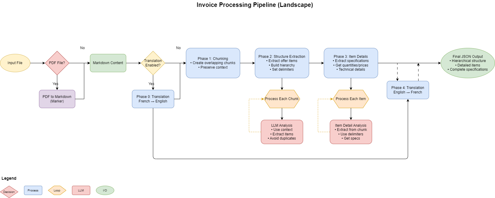

# Large Invoice Parser

A Python pipeline for processing and analyzing construction/engineering invoices and technical specifications, with support for multi-language processing.

## Features

- 📄 Parse PDF and Markdown invoice documents
- 🔍 Extract hierarchical section structures
- 🔄 Smart document chunking with context preservation
- 🌐 French/English translation support
- 💡 Intelligent section and item analysis
- 📊 Detailed output in JSON format

## Installation

1. Create and activate a virtual environment:
```sh
python -m venv large_invoice_parser
source large_invoice_parser/bin/activate  # On Unix/MacOS
# or
.\large_invoice_parser\Scripts\activate  # On Windows
```

2. Install dependencies:
```sh
pip install -r requirements.txt
```

## Usage

### Basic Usage

Process a single invoice:
```sh
python main.py examples/sample_invoice.md -o processed_invoice.json
```

### Advanced Options

```sh
python main.py <input_file> [options]

Options:
  --output, -o         Output JSON file path
  --config, -c         Custom config file path (default: config.yaml)
  --no-translation     Disable translation features
  --french-output     Generate output in French
  --save-markdown     Save converted markdown for PDF inputs
  --keep-converted    Keep temporary markdown files
```

### Configuration

Create a `config.yaml` file to customize the pipeline:

```yaml
results_dir: "pipeline_results"
context_window_size: 8192
max_context_window: 32768
structure_model: "llama3.2:3b"
analysis_model: "llama3.2:7b"
max_chunk_size: 2000
enable_translation: true
```

## Output Structure

The parser generates structured JSON output containing:
- Hierarchical section organization
- Technical specifications
- Item details and quantities
- Pricing information (when available)

## Pipeline Overview



The diagram above illustrates the complete processing pipeline from input file to final JSON output, including optional translation steps and detailed analysis phases.

## Pipeline Phases

1. 🔄 Document Translation (optional)
2. 📑 Smart Content Chunking
3. 🏗️ Structure Extraction
4. 📝 Detailed Item Analysis
5. 🔄 Final Translation (optional)

## Requirements

- Python 3.11+
- See `requirements.txt` for package dependencies

## License

MIT License

Copyright (c) 2025 Large Invoice Parser Contributors

Permission is hereby granted, free of charge, to any person obtaining a copy
of this software and associated documentation files (the "Software"), to deal
in the Software without restriction, including without limitation the rights
to use, copy, modify, merge, publish, distribute, sublicense, and/or sell
copies of the Software, and to permit persons to whom the Software is
furnished to do so, subject to the following conditions:

The above copyright notice and this permission notice shall be included in all
copies or substantial portions of the Software.

THE SOFTWARE IS PROVIDED "AS IS", WITHOUT WARRANTY OF ANY KIND, EXPRESS OR
IMPLIED, INCLUDING BUT NOT LIMITED TO THE WARRANTIES OF MERCHANTABILITY,
FITNESS FOR A PARTICULAR PURPOSE AND NONINFRINGEMENT. IN NO EVENT SHALL THE
AUTHORS OR COPYRIGHT HOLDERS BE LIABLE FOR ANY CLAIM, DAMAGES OR OTHER
LIABILITY, WHETHER IN AN ACTION OF CONTRACT, TORT OR OTHERWISE, ARISING FROM,
OUT OF OR IN CONNECTION WITH THE SOFTWARE OR THE USE OR OTHER DEALINGS IN THE
SOFTWARE.
